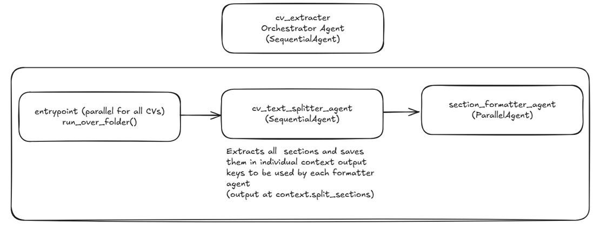
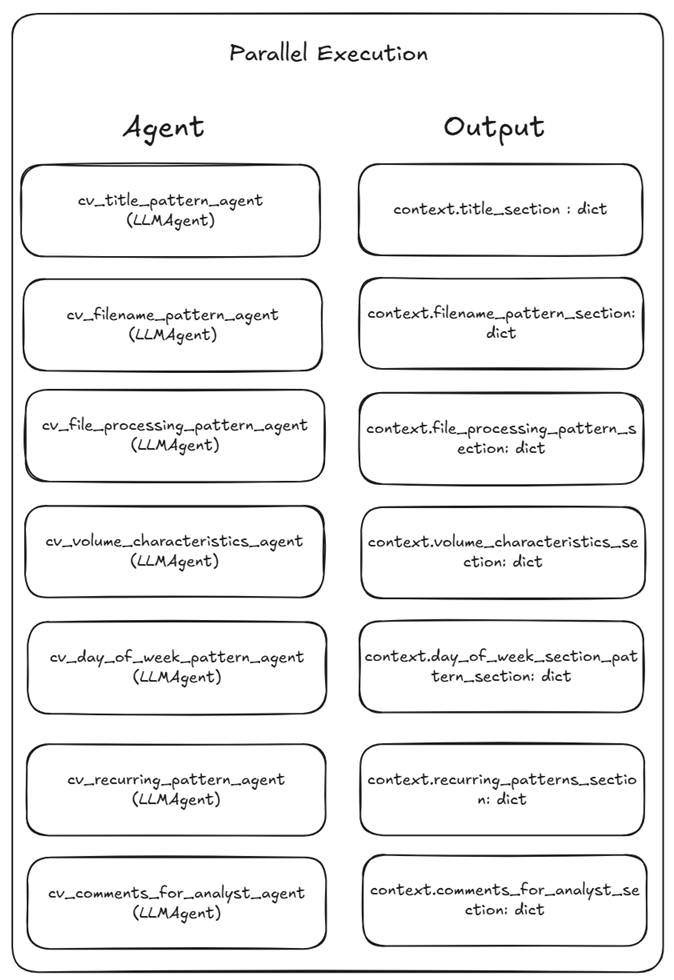
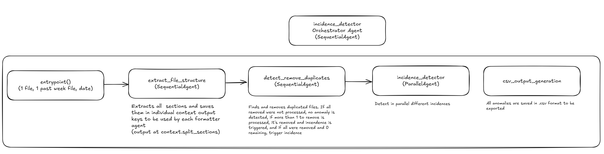
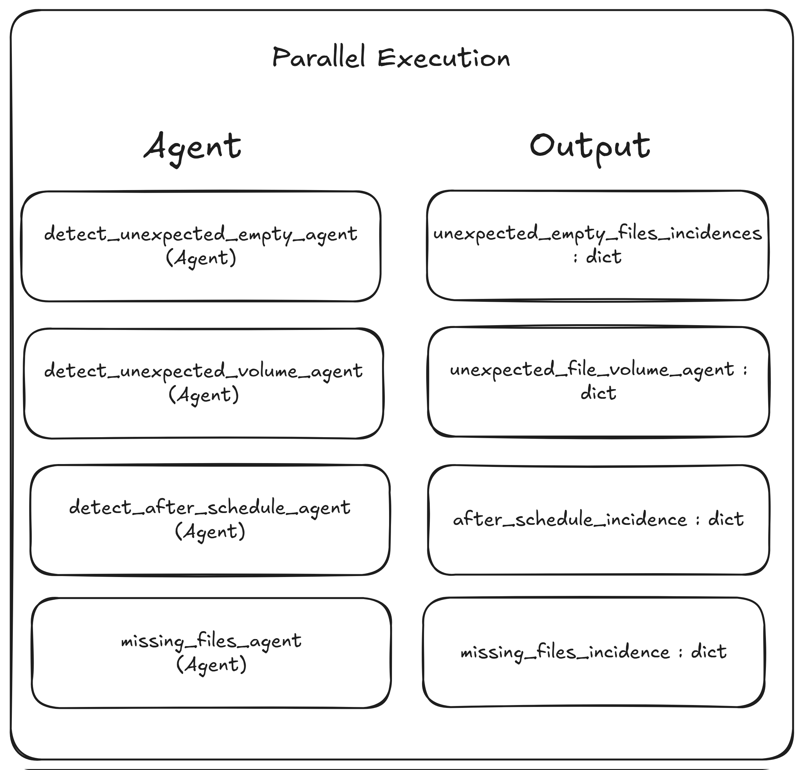

# AI FACTORY

AI Factory is a Google-ADK powered framework for end to end payment compliance analysis and incidence detector

This end to end agent is capable of:
- Read complex CV sources and split them based on LLM thinking rules
- Extract precise schemas on multiple input formats (can handle typos, regex, special characters and tables on ASCII format)
- Infers and clean complex IDs based on rules matched by LLM soft thinking
- Calculate and highlight incidences on payment compliance (IN PROGRESS)
- Report incidences with actions to fix them as soon as possible (IN PROGRESS)

Agents are able to extract multiple schemas at the same time by parallel excecution, also, a factory framework for agents in given in the code for fast creation and iteration

## Agents Workflow

The AI Factory is mainly based on 3 main agents + one global orchestrator with the following features:
- Each main agent contains its own orchestrator to be exported on the main loop
- Each agent is exported via an agent factory function
- Each agent can be self-executed on single or multiple files (parallel if a list of files is given)

## Installation and Usage

Simple way to use the repo is through uv

You can install dependencies by running

```python
uv sync
```

Agents can be used through orchestrators or individually, they expect a source file path

### Running individual agents

For running an inidivual agent you can use the ```agents.py``` script at the agent location as

```python
uv run python src/ai_factory/agents/cv_extracter/extract_day_of_week_pattern/extract_sections.py
```

or calling as a package

```python
uv run python src.ai_factory.agents.cv_extracter.extract_day_of_week_pattern.extract_sections
```

Individual agents saves the generated state on disk for future examination

### Running orchestrators

For running an individual orchestrator you can use the ```orchestrator.py``` script at the orchestrator location as

```python
uv run python src/ai_factory/agents/cv_extracter/orchestrator/orchestrator.py
```

or calling as a package

```python
uv run python src.ai_factory.agents.cv_extracter.orchestrator.orchestrator
```

For running incidence orchestrator it is expected to have run the cv_extracter one before

```
uv run python src/ai_factory/agents/incidence_detector/orchestrator/orchestrator.py \
  --date 2025-09-08_20_00_UTC \
  --files-json dataset_files/2025-09-08_20_00_UTC/files.json \
  --files-last-weekday-json dataset_files/2025-09-08_20_00_UTC/files_last_weekday.json
```

## Agents and Orchestrators composition

Here we explore the agents, orchestrators and architecture composition

### Agents composition

Each individual agent is a module with 4 main scripts: ```agents.py```, ```prompts.py```, ```schemas.py``` and ```tools.py``` (optional)

```
├── __init__.py
├── agents.py
├── prompts.py
├── schemas.py
└── tools.py
```

- ```agents.py``` contains the agent definition, export factory function and an individual isolated execution
- ```prompts.py``` contains the model_instruction and model_description
- ```schemas.py``` contains the target output schema
- ```tools.py``` contains tools to be used by the agent (optional)

Agents can be exported via the make_agent function

### Orchestrators Composition

Each individual agent is a module with 2 main scripts: ```orchestrator.py``` and ```plan.py```

```
├── __init__.py
├── orchestrator.py
└── plan.py
```

- ```orchestrator.py``` contains the agent orchestrator execution
- ```plan.py``` contains the agent graph to be exported on higher level orchestrator calls

Orchestrators can be exported via the build_overall_workflow function

## Agents Architecture

Here are the agents architecture for ```cv_extracter``` and ```incidence_detector```

### cv_extracter

The main orchestrator inputs one or more CV file into the text splitter agent, then it's formatted in parallel by each section



Each section is processed in parallel to optimize resources



### incidence_detector

The main orchestrator inputs the current day json, the past week json and the current date as string



Each section is processed in parallel to optimize resources



## LICENSE

Demo & Evaluation License

Copyright (c) 2025 thefrancho

Permission is hereby granted to any person reviewing this repository
to use the source code for the sole purpose of evaluation, education,
and technical demonstration.

The following restrictions apply:

1. The repository, in whole or in part, may NOT be used for any
   commercial purposes, including but not limited to offering
   services, integrating into proprietary products, or redistributing
   for profit.

2. The repository may NOT be used in production systems or any
   environment where reliability, security, or compliance is required.

3. Sensitive or proprietary data referenced in this repository is
   explicitly excluded from this license and is not authorized for
   distribution under any circumstance.

4. Redistribution of this repository (or substantial portions of it)
   must retain this license and attribution to the original author.

THIS SOFTWARE IS PROVIDED "AS IS", WITHOUT WARRANTY OF ANY KIND,
EXPRESS OR IMPLIED, INCLUDING BUT NOT LIMITED TO THE WARRANTIES OF
MERCHANTABILITY, FITNESS FOR A PARTICULAR PURPOSE AND NONINFRINGEMENT.